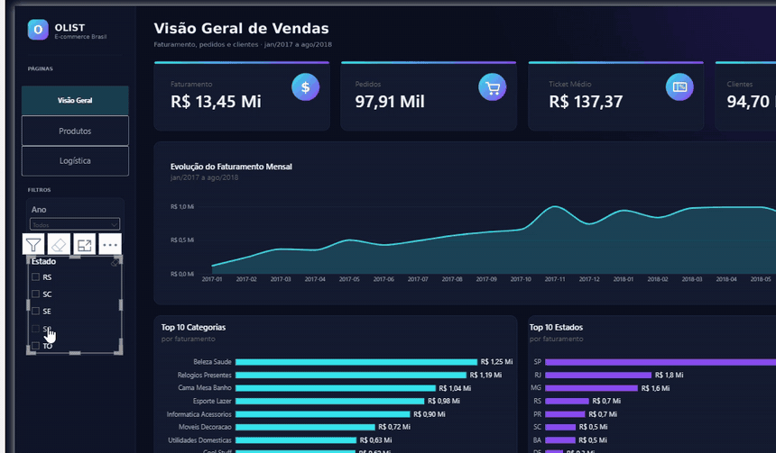
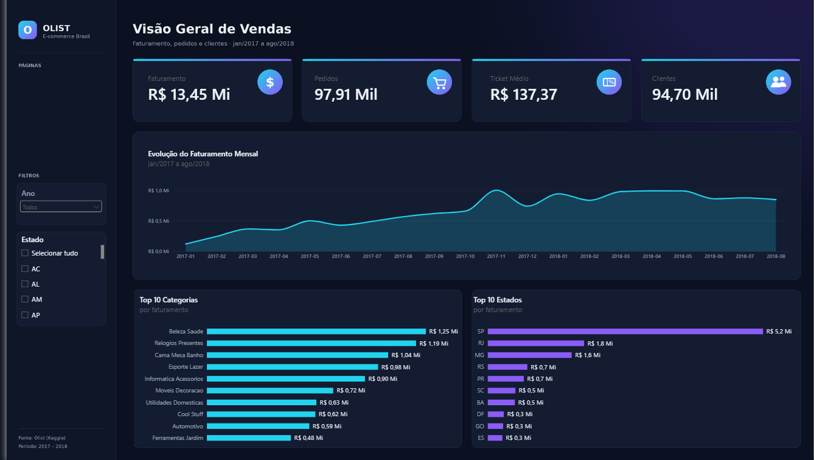
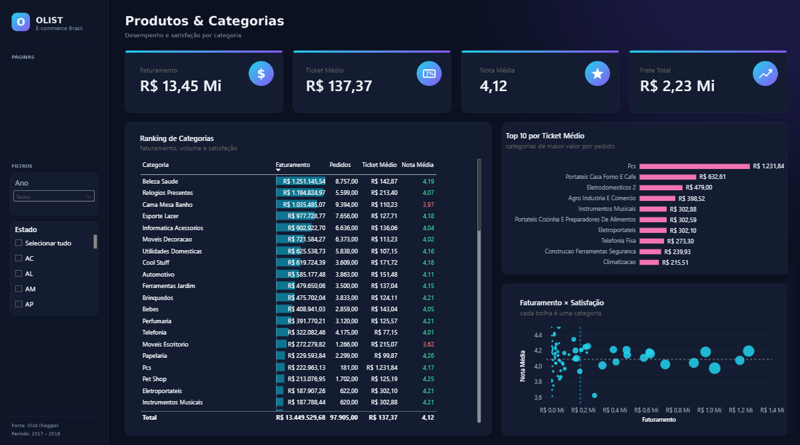
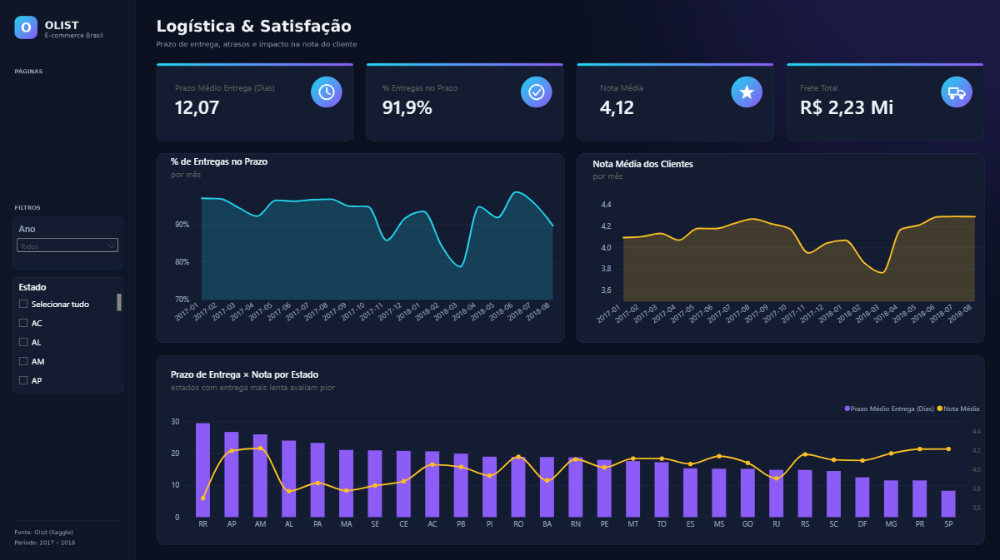
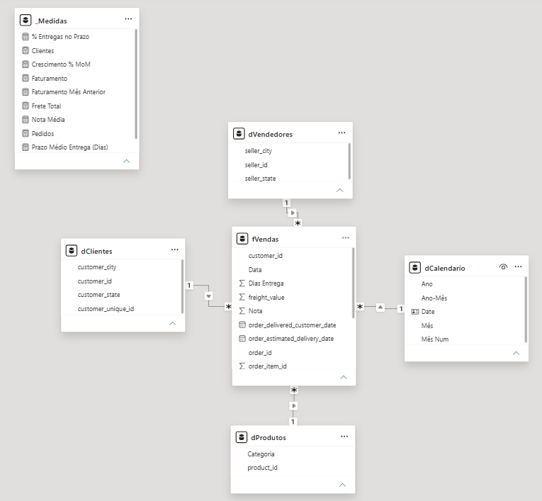

# 📊 Dashboard de Vendas — E-commerce Olist (Power BI)

**Projeto de portfólio desenvolvido por [Harley Lima](https://www.linkedin.com/in/harley-lima-b195a5329)**, do dado bruto ao dashboard final: tratamento no Power Query, modelagem em estrela, medidas DAX, design e análise.




---

## 🎯 O problema

A Olist é um marketplace brasileiro que conecta lojistas a grandes plataformas de venda. Com dados reais de **~100 mil pedidos (jan/2017 a ago/2018)**, o dashboard responde três perguntas de negócio:

1. **Como as vendas evoluíram** e onde está concentrado o faturamento?
2. **Quais categorias vendem mais**, e quais vendem bem mas deixam o cliente insatisfeito?
3. **A logística afeta a satisfação?** Atrasos e prazos longos derrubam a nota do cliente?

## 💡 Principais insights

| | Achado | Evidência no dashboard |
|---|---|---|
| 📈 | O faturamento **cresceu de forma consistente ao longo de 2017**, teve pico na Black Friday (nov/2017) e se estabilizou perto de **R$ 1 Mi/mês** em 2018. | R$ 13,45 Mi no período · 97,9 mil pedidos · ticket médio de R$ 137 |
| 📍 | **São Paulo concentra ~38% do faturamento** (R$ 5,15 Mi), quase 3× o 2º estado (RJ, R$ 1,8 Mi). | Top 10 Estados |
| ⚠️ | **Cama Mesa Banho é a 3ª categoria que mais fatura (R$ 1,04 Mi), mas tem nota 3,97**, abaixo da média geral (4,12). Maior volume com cliente insatisfeito. | Ranking de Categorias + dispersão Faturamento × Satisfação |
| 💻 | **PCs têm ticket de R$ 1.231**, ~9× a média, com apenas 181 pedidos: nicho de alto valor. | Top 10 por Ticket Médio |
| 🚚 | **Quando a entrega atrasa, a nota cai junto.** As entregas no prazo despencaram para ~79% em mar/2018 e a nota média caiu para ~3,8 **no mesmo mês**. O mesmo padrão aparece em nov–dez/2017. | % de Entregas no Prazo × Nota Média por mês |
| 🗺️ | **Estados com entrega mais lenta avaliam pior.** RR leva ~30 dias e tem a pior nota (~3,7). AL, MA, SE e PA passam de 20 dias com notas abaixo de 3,9. SP recebe em ~8 dias, com 94% no prazo e nota 4,21. | Prazo de Entrega × Nota por Estado |

**Recomendação:** priorizar a logística para o Norte/Nordeste e investigar a qualidade dos produtos de Cama Mesa Banho. As duas ações atacam diretamente os pontos que mais derrubam a satisfação.

## 🖥️ Páginas do dashboard

### 1. Visão Geral de Vendas
KPIs principais, evolução mensal do faturamento e rankings de categorias e estados.



### 2. Produtos & Categorias
Ranking completo com barras de dados e **formatação condicional na nota** (vermelho < 4, verde ≥ 4,2), ticket médio por categoria e dispersão **Faturamento × Satisfação** com linhas de média formando quadrantes.



### 3. Logística & Satisfação
Prazo de entrega, % de entregas no prazo e o impacto direto na nota do cliente, por mês e por estado.



**Interatividade:** navegação entre páginas pela barra lateral, filtros de **Ano** e **Estado** sincronizados entre as 3 páginas, e filtro cruzado (clicar em qualquer ponto de um gráfico filtra a página inteira).

## 🛠️ Como foi construído

### 1. Tratamento dos dados (Power Query)
- Importação dos **9 arquivos CSV** do dataset, com a localidade do arquivo ajustada para **Inglês (EUA)**. Os CSVs usam ponto como separador decimal e, em português, o Power BI lia `58.90` como `5890`.
- Montagem da tabela fato **`fVendas`** no nível de **item de pedido**, unindo pedidos, itens e avaliações.
- Remoção de pedidos **cancelados e indisponíveis**, para o faturamento refletir só vendas efetivas.
- Tratamento de categorias vazias: células com texto vazio (não `null`) substituídas por **"Sem Categoria"**, usando *coincidir com todo o conteúdo da célula*.
- Colunas de apoio: **Dias Entrega** (compra → entrega) e **Status Entrega** (classifica o pedido como "No Prazo", atrasado ou "Não Entregue", comparando com a data estimada).

### 2. Modelagem (esquema estrela)



| Tabela | Tipo | Relacionamento com `fVendas` |
|---|---|---|
| `fVendas` | Fato (itens de pedido) | — |
| `dClientes` | Dimensão | 1 : * por `customer_id` |
| `dProdutos` | Dimensão | 1 : * por `product_id` |
| `dVendedores` | Dimensão | 1 : * por `seller_id` |
| `dCalendario` | Dimensão de datas (marcada como tabela de datas) | 1 : * por data |
| `_Medidas` | Tabela só de medidas, para organização | — |

Todos os relacionamentos são **1 : * com filtro em direção única**.

### 3. Medidas DAX

Código completo e comentado em [`dax/medidas.dax`](dax/medidas.dax).

| Medida | O que calcula |
|---|---|
| **Faturamento** | Soma do valor dos itens vendidos |
| **Pedidos** | Contagem distinta de pedidos |
| **Ticket Médio** | Faturamento ÷ Pedidos |
| **Clientes** | Contagem distinta de clientes únicos |
| **Frete Total** | Soma do valor de frete |
| **Nota Média** | Média da avaliação **por pedido** |
| **Prazo Médio Entrega (Dias)** | Média de dias entre compra e entrega **por pedido** |
| **% Entregas no Prazo** | Pedidos entregues até a data estimada ÷ pedidos entregues |
| **Faturamento Mês Anterior** | Inteligência de tempo com `DATEADD` |
| **Crescimento % MoM** | Variação percentual mês contra mês |

> **Cuidado com a granularidade:** a tabela fato é por *item*, mas nota e prazo são por *pedido*. Um pedido com 3 itens contaria a mesma nota 3 vezes. Por isso, essas medidas iteram sobre os pedidos distintos (`AVERAGEX(VALUES(fVendas[order_id]), ...)`) em vez de fazer uma média simples da coluna.

### 4. Design
- **Tema customizado** (`design/tema_olist_dark.json`) com paleta escura e cores de destaque consistentes: ciano para vendas, violeta para estados/prazo, rosa para ticket e amarelo para nota.
- **Fundos de página** (`design/fundos/`) com barra lateral, cartões e painéis desenhados. Os visuais ficam transparentes por cima, o que dá acabamento de aplicativo sem sobrecarregar o arquivo.
- Cada cor tem um significado fixo em todas as páginas, então o leitor não precisa reaprender a legenda a cada gráfico.

## 🧰 Ferramentas
**Power BI Desktop** · **Power Query (M)** · **DAX** · Modelagem dimensional

## ▶️ Como abrir
1. Baixe o arquivo [`dashboard-vendas-olist.pbix`](dashboard-vendas-olist.pbix).
2. Abra no [Power BI Desktop](https://www.microsoft.com/pt-br/power-platform/products/power-bi/desktop) (gratuito).

Os dados já estão importados no arquivo, então não é preciso baixar o dataset para visualizar. Para refazer o tratamento do zero, veja [`dados/README.md`](dados/README.md).

## 📁 Estrutura do repositório
```
├── dashboard-vendas-olist.pbix   # arquivo do Power BI
├── imagens/                      # prints das páginas, modelo e GIF de demonstração
├── dax/medidas.dax               # todas as medidas DAX, comentadas
├── design/
│   ├── tema_olist_dark.json      # tema customizado do Power BI
│   └── fundos/                   # imagens de fundo das 3 páginas
└── dados/README.md               # onde baixar o dataset original
```

## 👤 Autoria
Projeto **idealizado e construído por Harley Lima**: tratamento dos dados, modelagem, medidas DAX, montagem dos visuais e análise dos resultados. Usei IA (Claude) como apoio pontual, para tirar dúvidas da interface do Power BI e gerar as imagens de fundo e o tema do layout.

**Dados:** [Brazilian E-Commerce Public Dataset by Olist](https://www.kaggle.com/datasets/olistbr/brazilian-ecommerce), disponibilizado publicamente pela Olist no Kaggle (ver licença na página do dataset).

---

📫 **Contato:** [LinkedIn](https://www.linkedin.com/in/harley-lima-b195a5329) · harleylima25@gmail.com
